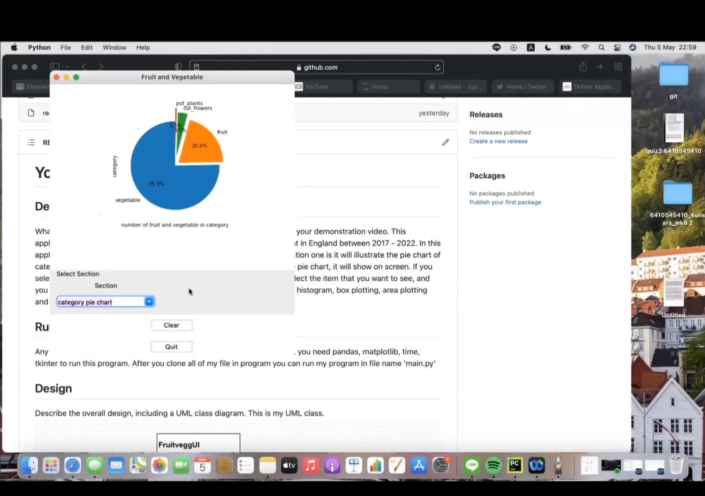
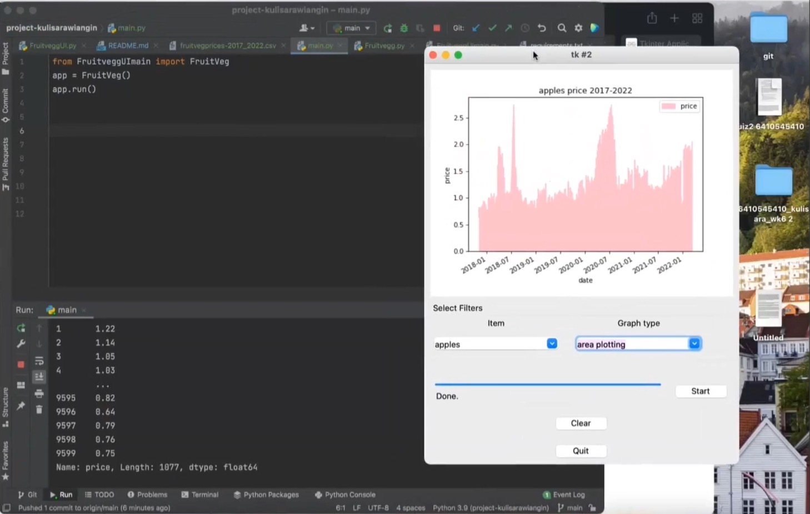
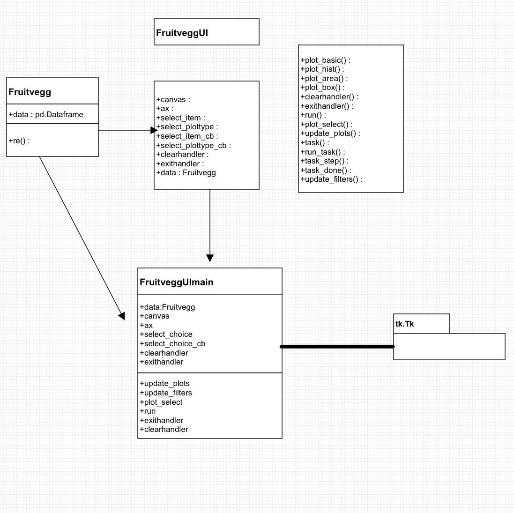

Fruit and Vegetable Prices in 2017-2022
 
## Description
This application illustrate the graph about the price of fruit, vegetable and plant in England 
between 2017 - 2022. data that I will use in this project is from kaggle.com(https://www.kaggle.com/datasets/datota/fruit-and-vegatable-prices-in-uk-2017-2022) .
In this application you can select the section that you want to see, it has  two section 
one is it will illustrate the pie chart of category in this data and one is the item and price graph. If you
select the pie chart, it will show on screen. If you select the item and price it will display another screen
that you have to select the item that you want to see, and you can select type of graph that you want this application to show, it has histogram, box plotting, area plotting 
and basic plotting.

these are the screen of the application

https://youtu.be/oTTxhG81HTM
this is my demonstration of the application.
## Running the Application
 you need pandas, matplotlib, time, tkinter to run this program. After you clone all of my file in program you 
can run my program in file name 'main.py'
## Design
This is my UML class.

After user run this application, the screen will provide user to select what section user want to see.
if user select the pie chart the pie chart will display but if user select the item and price 
the screen will display then user will see the graph line and the choice of item and type of graph that user can select.
And after user select item and type of graph, user need to click on the start button then user have to wait about 5 seconds then the graph will appear.
on the bottom of screen, it has clear button to clear all the previous data that selected by user and 
a quit button that will take user back to first page.

 
## Design Patterns Used
1.Model-View-Controller Pattern
I use it to interface with user. user have interaction with the application when user can select  section, 
the item and type of plot in the application to illustrate.

2. Decorator Pattern
I use it to print price of the item that select by user in terminal.When user select item and type of graph,
then after the graph appear, The price of item will show in the terminal.
 

